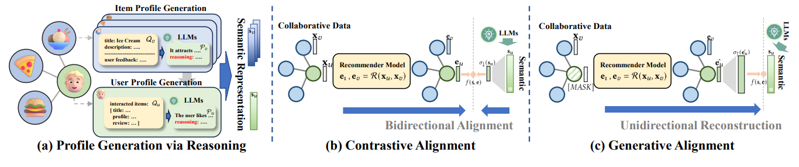

# RLMRec: Representation Learning with Large Language Models for Recommendation

 This is the PyTorch implementation by <a href='https://github.com/Re-bin'>@Re-bin</a> for RLMRec model proposed in this [paper](https://arxiv.org/abs/2310.15950):

 >**Representation Learning with Large Language Models for Recommendation**  
 >Xubin Ren, Wei Wei, Lianghao Xia, Lixin Su, Suqi Cheng, Junfeng Wang, Dawei Yin, Chao Huang*\
 >*WWW2024*


\* denotes corresponding author
<p align="center">

</p>

In this paper, we propose a model-agnostic framework **RLMRec** that enhances existing recommenders with LLM-empowered representation learning. It proposes a paradigm that integrates representation learning with LLMs to capture intricate semantic aspects of user behaviors and preferences. RLMRec incorporates auxiliary textual signals, develops a user/item profiling paradigm empowered by LLMs, and aligns the semantic space of LLMs with the representation space of collaborative relational signals through a cross-view alignment framework.

## 📝 Environment
You can run the following command to download the codes faster:
```bash
git clone --depth 1 https://github.com/HKUDS/RLMRec.git
```

Then run the following commands to create a conda environment:

```bash
conda create -y -n rlmrec python=3.9
conda activate rlmrec
pip install torch==1.13.1+cu116 torchvision==0.14.1+cu116 torchaudio==0.13.1 --extra-index-url https://download.pytorch.org/whl/cu116
pip install torch-scatter -f https://data.pyg.org/whl/torch-1.13.1+cu117.html
pip install torch-sparse -f https://data.pyg.org/whl/torch-1.13.1+cu117.html
pip install pyyaml tqdm
```

😉 The codes are developed based on the [SSLRec](https://github.com/HKUDS/SSLRec) framework.

## 📚 Text-attributed Recommendation Dataset

We utilized three public datasets to evaluate RLMRec:  *Amazon-book, Yelp,* and *Steam*.

Each user and item has a generated text description.

First of all, please **download the data** by running following commands.
 ```
 cd data/
 wget https://archive.org/download/rlmrec_data/data.zip
 unzip data.zip
 ```

You can also download our data from the [[Google Drive](https://drive.google.com/file/d/1PzePFsBcYofG1MV2FisFLBM2lMytbMdW/view?usp=sharing)].


Each dataset consists of a training set, a validation set, and a test set. During the training process, we utilize the validation set to determine when to stop the training in order to prevent overfitting.
```
- amazon(yelp/steam)
|--- trn_mat.pkl    # training set (sparse matrix)
|--- val_mat.pkl    # validation set (sparse matrix)
|--- tst_mat.pkl    # test set (sparse matrix)
|--- usr_prf.pkl    # text description of users
|--- itm_prf.pkl    # text description of items
|--- usr_emb_np.pkl # user text embeddings
|--- itm_emb_np.pkl # item text embeddings
```

### User/Item Profile
- Each profile is a **high quality text description** of a user/item.
- Both user and item profiles are generated from **Large Language Models** from raw text data.
- The `user profile` (in `usr_prf.pkl`) shows the particular types of items that the user tends to prefer. 
- The `item profile` (in `itm_prf.pkl`) articulates the specific types of users that the item is apt to attract. 

😊 You can run the code `python data/read_profile.py` as an example to read the profiles as follows.
```
$ python data/read_profile.py
User 123's Profile:

PROFILE: Based on the kinds of books the user has purchased and reviewed, they are likely to enjoy historical
fiction with strong character development, exploration of family dynamics, and thought-provoking themes. The user 
also seems to enjoy slower-paced plots that delve deep into various perspectives. Books with unexpected twists, 
connections between unrelated characters, and beautifully descriptive language could also be a good fit for 
this reader.

REASONING: The user has purchased several historical fiction novels such as 'Prayers for Sale' and 'Fall of 
Giants' which indicate an interest in exploring the past. Furthermore, the books they have reviewed, like 'Help 
for the Haunted' and 'The Leftovers,' involve complex family relationships. Additionally, the user appreciates 
thought-provoking themes and character-driven narratives as shown in their review of 'The Signature of All 
Things' and 'The Leftovers.' The user also enjoys descriptive language, as demonstrated in their review of 
'Prayers for Sale.'
```

### Semantic Representation
- Each user and item has a semantic embedding encoded from its own profile using **Text Embedding Models**.
- The encoded semantic embeddings are stored in `usr_emb_np.pkl` and `itm_emb_np.pkl`.

### Mapping to Original Data

The original data of our dataset can be found from following links (thanks to their work):
- Yelp: https://www.yelp.com/dataset
- Amazon-book: https://cseweb.ucsd.edu/~jmcauley/datasets/amazon/links.html
- Steam: https://github.com/kang205/SASRec

We provide the **mapping dictionary** in JSON format in the `data/mapper` folder to map the `user/item ID` in our processed data to the `original identification` in original data (e.g., asin for items in Amazon-book).

🤗 Welcome to use our processed data to improve your research!

## 🚀 Examples to run the codes

The command to evaluate the backbone models and RLMRec is as follows. 

  - Backbone 

    ```python encoder/train_encoder.py --model {model_name} --dataset {dataset} --cuda 0```   

  - RLMRec-Con **(Constrastive Alignment)**:

    ```python encoder/train_encoder.py --model {model_name}_plus --dataset {dataset} --cuda 0```

  - RLMRec-Gen **(Generative Alignment)**:

    ```python encoder/train_encoder.py --model {model_name}_gene --dataset {dataset} --cuda 0```

Supported models/datasets:

* model_name:  `gccf`, `lightgcn`, `sgl`, `simgcl`, `dccf`, `autocf`
* dataset: `amazon`, `yelp`, `steam`

Hypeparameters:

* The hyperparameters of each model are stored in `encoder/config/modelconf` (obtained by grid-search).

 **For advanced usage of arguments, run the code with --help argument.**

## 🔮 Profile Generation and Semantic Representation Encoding
Here we provide some examples with *Yelp* Data to generate user/item profiles and semantic representations.

Firstly, we need to complete the following three steps.
- Install the openai library `pip install openai`
- Prepare your **OpenAI API Key**
- Enter your key on `Line 5` of these files: `generation\{item/user/emb}\generate_{profile/emb}.py`.

Then, here are the commands to generate the desired output with examples:

  - **Item Profile Generation**:

    ```python generation/item/generate_profile.py```   

  - **User Profile Generation**:

    ```python generation/user/generate_profile.py```

  - **Semantic Representation**:

    ```python generation/emb/generate_emb.py```

For semantic representation encoding, you can also try other text embedding models like [Instructor](https://github.com/xlang-ai/instructor-embedding) or [Contriever](https://github.com/facebookresearch/contriever).

😀 The **instructions** we designed are saved in the `{user/item}_system_prompt.txt` files and also the `generation/instruction` folder. You can modify them according to your requirements and generate the desired output!

## 🌟 Citation
If you find this work is helpful to your research, please consider citing our paper:
```bibtex
@article{ren2023representation,
  title={Representation Learning with Large Language Models for Recommendation},
  author={Ren, Xubin and Wei, Wei and Xia, Lianghao and Su, Lixin and Cheng, Suqi and Wang, Junfeng and Yin, Dawei and Huang, Chao},
  journal={arXiv preprint arXiv:2310.15950},
  year={2023}
}
```

**Thanks for your interest in our work!**
